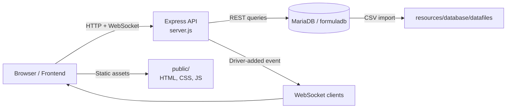

<div align="center">


# Formula 1 Stats Dashboard

**A full-stack Formula 1 analytics dashboard for exploring driver performance, trends, and race data.**

[](https://nodejs.org/)
[](https://expressjs.com/)
[](https://mariadb.org/)
[](https://www.chartjs.org/)
[](https://leafletjs.com/)
[](https://developer.mozilla.org/en-US/docs/Web/API/WebSockets_API)
[](https://www.docker.com/)

</div>

> 🎓 Created for the Web Technology course assignment.

## 📑 Table of Contents

- [📖 About](#-about)
- [🏗️ Architecture](#️-architecture)
- [✨ Features](#-features)
- [🛠️ Tech Stack](#️-tech-stack)
- [🚀 Getting Started](#-getting-started)
- [📡 Usage / API / Infrastructure](#-usage--api--infrastructure)
- [👤 Author](#-author)

## 📖 About

This project is a Formula 1 statistics application built with a Node.js Express backend and a MariaDB dataset. It serves historical F1 data, visualizes driver trends in the browser, and supports real-time updates when a new driver is added.

The app is organized around a small REST API and a static frontend, with data loaded from CSV files into the database and exposed through a set of driver-focused queries. See [server.js](server.js), [public/index.html](public/index.html), and the database setup in [resources/database/init.sql](resources/database/init.sql).

## 🏗️ Architecture



## ✨ Features

- Search and select drivers from the database.
- View summary stats such as total races, win percentage, average start position, and average finish position.
- Explore driver charts for position distribution, points per season, and retirement reasons.
- Add a new driver from the frontend form and immediately refresh the map and list.
- Use a Leaflet map to display drivers in the UI.
- Receive real-time updates through a WebSocket connection when another client adds a driver.
- Query a REST API for drivers, circuits, constructors, races, and results.

## 🛠️ Tech Stack

| Area | Technologies |
| --- | --- |
| Frontend | HTML, CSS, JavaScript, Chart.js, Leaflet |
| Backend | Node.js, Express, CORS, WebSocket API |
| Database | MariaDB, promise-mysql |
| Environment / tooling | Docker, ESLint, Nodemon, dotenv |
| Data source | CSV imports loaded into MariaDB via [resources/database/init.sql](resources/database/init.sql) |

## 🚀 Getting Started

### Prerequisites

- Node.js 18+ or a compatible version
- npm
- Docker (for the MariaDB container setup in this repo)
- A local MariaDB-compatible instance, or the provided database container

### Clone the repository

```bash
git clone <repository-url>
cd project
```

### Configure environment variables

Create a `.env` file in the project root with the values used by your MariaDB instance:

| Variable | Description |
| --- | --- |
| `DB_HOST` | MariaDB host, typically `localhost` for a local container |
| `DB_USER` | Database user, matching the user created in [resources/database/init.sql](resources/database/init.sql) |
| `DB_PASSWORD` | Database password for `DB_USER` |
| `DB_DATABASE` | Database name, set to `formuladb` for the provided dataset |
| `DB_PORT` | MariaDB port, typically `3306` |

Example:

```bash
cat > .env <<'EOF'
DB_HOST=localhost
DB_USER=mrice
DB_PASSWORD=1379
DB_DATABASE=formuladb
DB_PORT=3306
EOF
```

### Start the database

From the repository root:

```bash
docker build -t formuladb ./resources/database
docker run --detach -p 3306:3306 --name formula1db --env MARIADB_ROOT_PASSWORD=your_root_password formuladb
```

The database container loads the schema and CSV data from [resources/database/init.sql](resources/database/init.sql) and the files in [resources/database/datafiles](resources/database/datafiles).

### Install dependencies and run the app

```bash
npm install
npm start
```

For local development with restart-on-change:

```bash
npm run dev
```

The Express server listens on port `3000`, and the WebSocket server listens on port `8080`.

## 📡 Usage / API / Infrastructure

The project serves a single-page dashboard from `/` and exposes the REST API below. The backend is implemented in [server.js](server.js), while the SQL access layer is in [logic/database](logic/database).

| Method | Route | Description |
| --- | --- | --- |
| GET | `/` | Serves the static frontend from [public/index.html](public/index.html) |
| GET | `/circuits` | List all circuits |
| GET | `/circuits/:id` | Get one circuit by ID |
| POST | `/circuits` | Create a circuit |
| PUT | `/circuits/:id` | Update a circuit |
| DELETE | `/circuits/:id` | Delete a circuit |
| GET | `/constructors` | List all constructors |
| GET | `/constructors/:id` | Get one constructor by ID |
| POST | `/constructors` | Create a constructor |
| PUT | `/constructors/:id` | Update a constructor |
| DELETE | `/constructors/:id` | Delete a constructor |
| GET | `/drivers` | List all drivers |
| GET | `/drivers/:id` | Get one driver by ID |
| POST | `/drivers` | Create a driver |
| PUT | `/drivers/:id` | Update a driver |
| DELETE | `/drivers/:id` | Delete a driver |
| GET | `/drivers/:id/wins` | Get total wins and win percentage |
| GET | `/drivers/:id/qualifying` | Get qualifying stats |
| GET | `/drivers/:id/overtaking` | Get overtaking and average position data |
| GET | `/drivers/:id/teammates` | Compare performance against teammates |
| GET | `/drivers/:id/positions` | Get position counts |
| GET | `/drivers/:id/points` | Get points per season |
| GET | `/drivers/:id/retirements` | Get retirement statistics |
| GET | `/races` | List all races |
| GET | `/races/:id` | Get one race by ID |
| POST | `/races` | Create a race |
| PUT | `/races/:id` | Update a race |
| DELETE | `/races/:id` | Delete a race |
| GET | `/results` | List all results |
| GET | `/:raceId/results/:driverId` | Get a specific race result |
| POST | `/results` | Create a result |
| PUT | `/:raceId/results/:driverId` | Update a result |
| DELETE | `/:raceId/results/:driverId` | Delete a result |

### Infrastructure notes

- Static frontend assets are served from [public](public).
- Database schema and seed data are initialized by [resources/database/init.sql](resources/database/init.sql).
- The frontend uses Chart.js for charts and Leaflet for the map.
- A WebSocket server on port `8080` broadcasts newly added drivers to connected clients.

## 👤 Author

| Name | GitHub | LinkedIn |
| --- | --- | --- |
| Maurice De Kegel | [MriceDK](https://github.com/MriceDK) | [LinkedIn](https://www.linkedin.com/in/dekegelmaurice/) |